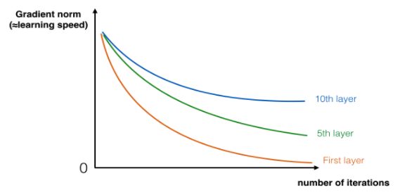

# ResNet_image_classifier
Image classification Using ResNet.

These materials are basicly from the Coursera lesson given by DeepLearning.ai and Francois Chollet's github repository, for detail please check :
- www.coursera.org/learn/convolutional-neural-networks
- Kaiming He, Xiangyu Zhang, Shaoqing Ren, Jian Sun - Deep Residual Learning for Image Recognition (2015)
- Francois Chollet's github repository: https://github.com/fchollet/deep-learning-models/blob/master/resnet50.py

## The problem of very deep neural networks
In recent years, neural networks have become deeper, with state-of-the-art networks going from just a few layers (e.g., AlexNet) to over a hundred layers.
The main benefit of a very deep network is that it can represent very complex functions. It can also learn features at many different levels of abstraction, from edges (at the lower layers) to very complex features (at the deeper layers). However, using a deeper network doesn't always help. A huge barrier to training them is vanishing gradients: very deep networks often have a gradient signal that goes to zero quickly, thus making gradient descent unbearably slow. More specifically, during gradient descent, as you backprop from the final layer back to the first layer, you are multiplying by the weight matrix on each step, and thus the gradient can decrease exponentially quickly to zero (or, in rare cases, grow exponentially quickly and "explode" to take very large values).
During training, you might therefore see the magnitude (or norm) of the gradient for the earlier layers descrease to zero very rapidly as training proceeds:

## build ResNet
In ResNets, a "shortcut" or a "skip connection" allows the gradient to be directly backpropagated to earlier layers:

The image on the left shows the "main path" through the network. The image on the right adds a shortcut to the main path. By stacking these ResNet blocks on top of each other, you can form a very deep network.
We also saw in lecture that having ResNet blocks with the shortcut also makes it very easy for one of the blocks to learn an identity function. This means that you can stack on additional ResNet blocks with little risk of harming training set performance. (There is also some evidence that the ease of learning an identity function--even more than skip connections helping with vanishing gradients--accounts for ResNets' remarkable performance.)
### The identity block
The identity block is the standard block used in ResNets, and corresponds to the case where the input activation (say  a[l]a[l] ) has the same dimension as the output activation (say  a[l+2]a[l+2] ). To flesh out the different steps of what happens in a ResNet's identity block, here is an alternative diagram showing the individual steps:

### The convolutional block
The ResNet "convolutional block" is the other type of block. You can use this type of block when the input and output dimensions don't match up. The difference with the identity block is that there is a CONV2D layer in the shortcut path:

The CONV2D layer in the shortcut path is used to resize the input  xx  to a different dimension, so that the dimensions match up in the final addition needed to add the shortcut value back to the main path. (This plays a similar role as the matrix  WsWs  discussed in lecture.) For example, to reduce the activation dimensions's height and width by a factor of 2, you can use a 1x1 convolution with a stride of 2. The CONV2D layer on the shortcut path does not use any non-linear activation function. Its main role is to just apply a (learned) linear function that reduces the dimension of the input, so that the dimensions match up for the later addition step.
